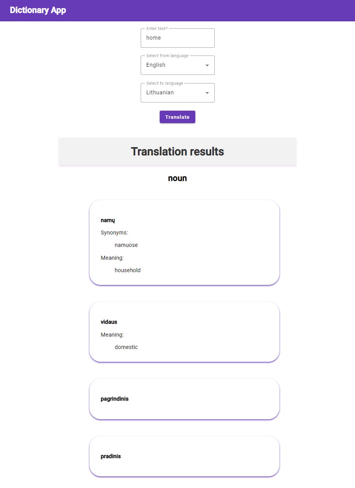
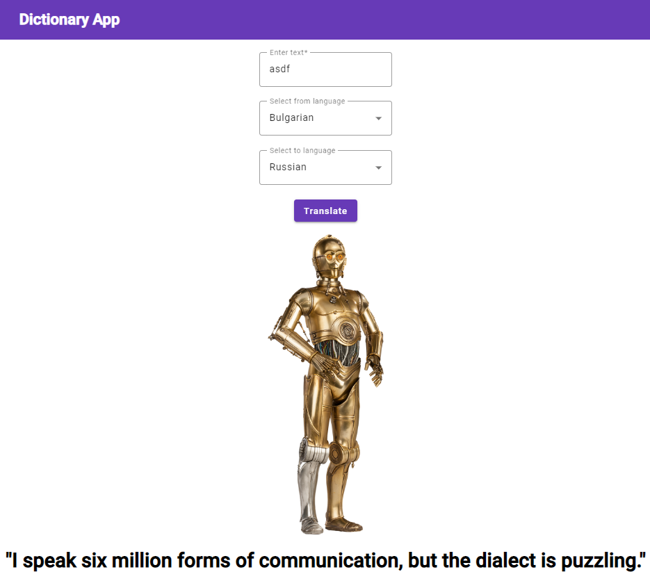

# MyDictionary

This is a homework project for the Client Side Technologies course at BME.

It is an Angular application that utilizes the Yandex Dictionary API for translation functionality. It allows users to translate text between different languages and optimizes performance through caching of translations and language combinations. The application includes features such as input validation, language selection, and a component-based architecture, making it a versatile and user-friendly translation tool.

## Screenshots

## Development server

Run `ng serve` for a dev server. Navigate to `http://localhost:4200/`. The application will automatically reload if you change any of the source files.

## Build

Run `ng build` to build the project. The build artifacts will be stored in the `dist/` directory.
